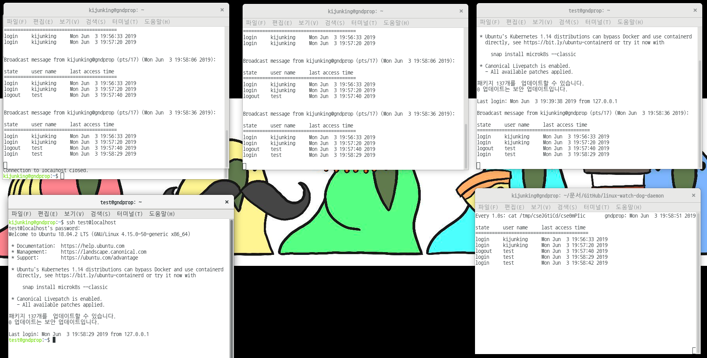

# Linux Watchdog Daemon

> This is the simple watchdog daemon

Daemon isn’t controlled by user. This runs infinite in background of system. Usually, daemon doesn’t have any parents process. So, it is generally PPID number is `1`. Therefore, daemon exists under the `init` process in whole process tree.

But already we knew that we execute the some program in the bash. It’s PPID is bash’s PPID. Then how to make PPID number to `1`. The solution is make the child to orphan. Some people says this method to “fork off and die”

According to this background logic. I make the “skeleton_daemon” which makes child to orphan. After, execute this function. Now, the PPID`1` daemon is made. Before we check another function, “skeleton_daemon” has signal ignore statements. Because of the daemon program must not be interfered by signal(e.g. user’s interrupt signal). This is very important things to make the daemon program.

Next, main function serves some exceptions, makes temporary file and directory making and checks utmp and wtmp files. In this area, only focus on the `utmp_watch` and `wtmp_watch`. Both of them are almost same structure. But not exactly same. Former one(`utmp_watch`) is to check the login user and writes that information to temporary file. Latter one(`wtmp_watch`) is to check the logout user and writes that information to temporary file.

Moreover, `wtmp_watch` has some special function which names `get_wtmp_user`. If you think easily, you might say it doesn’t necessary. Because of each entry has own user name. Unfortunately, logout entry doesn’t have any user name. Because of the entry’s status to DEAD_PROCESS. Another program which writes the `utmp` and `wtmp` deletes the entry’s user name and host information. According to this reason, we have to search the user name in certain log files(`wtmp` or  `utmp `). I checks that PID doesn’t delete when entry marks DEAD_PROCESS. So, I use that information to find user name. And that function gave me a correct logout user name.

